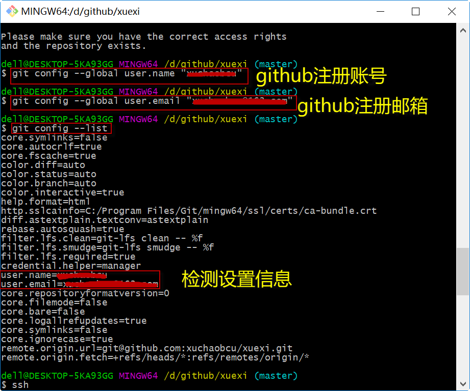
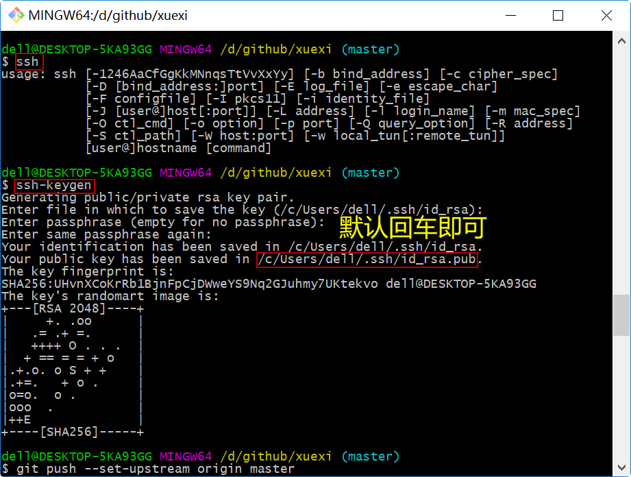
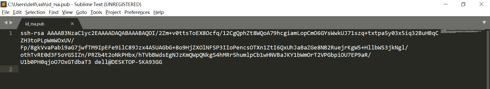
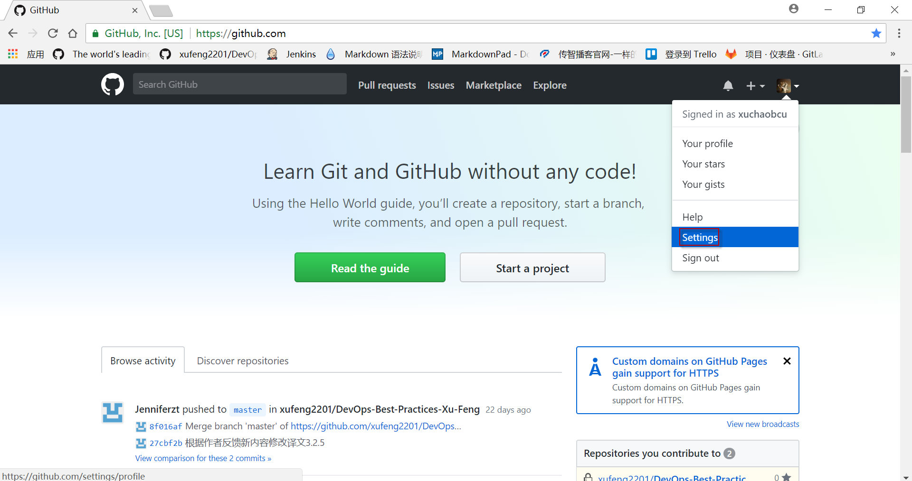
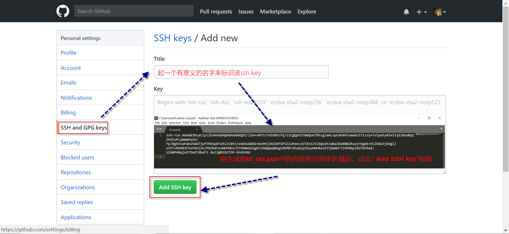
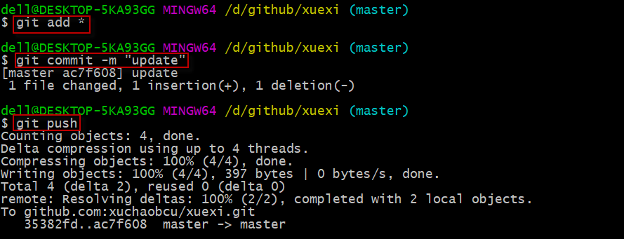

# 基于SSH协议的Github访问设置说明
***需求来源：***

当频繁push修改后的代码到github仓库时，我每次都需要输入用户名和密码，感觉严重影响工作效率。

***解决办法：***

百度

***参考文档：***

https://blog.csdn.net/u012373815/article/details/53575362

***自我实践：***

**实践步骤：**

1. 设置本地Git客户端的user name 和email

2. 生成本地ssh密钥对

3. 在GIthub上设置ssh生成的 publick key

   ​

**上机操作：**

1. **设置本地Git客户端的user name 和email**

​       git config --global user.name "github注册账号" 

​       git config --global user.email "github注册邮箱"

​       git config --list 

2. **生成本地ssh密钥对**

​       ssh

​       ssh-keygen

     

命令执行完成后，会在指定的目录下生成一下三个文件：

用本地文本编辑器打开文件id_rsa.pub,并复制器内容：

3. **在Github上设置ssh生成的 publick key**

   登陆github主页，点击个人图像，选中“Settings”;

   

   点击"SSH and GPG keys", 在Title中输入一个key的名字，然后再key区域将复制的id_rsa.pub内容拷贝进来，最后点击"Add SSH key"按钮。

   

4.**验证实验结果：**

修改代码后，直接运行git push命令：

大功告成。
