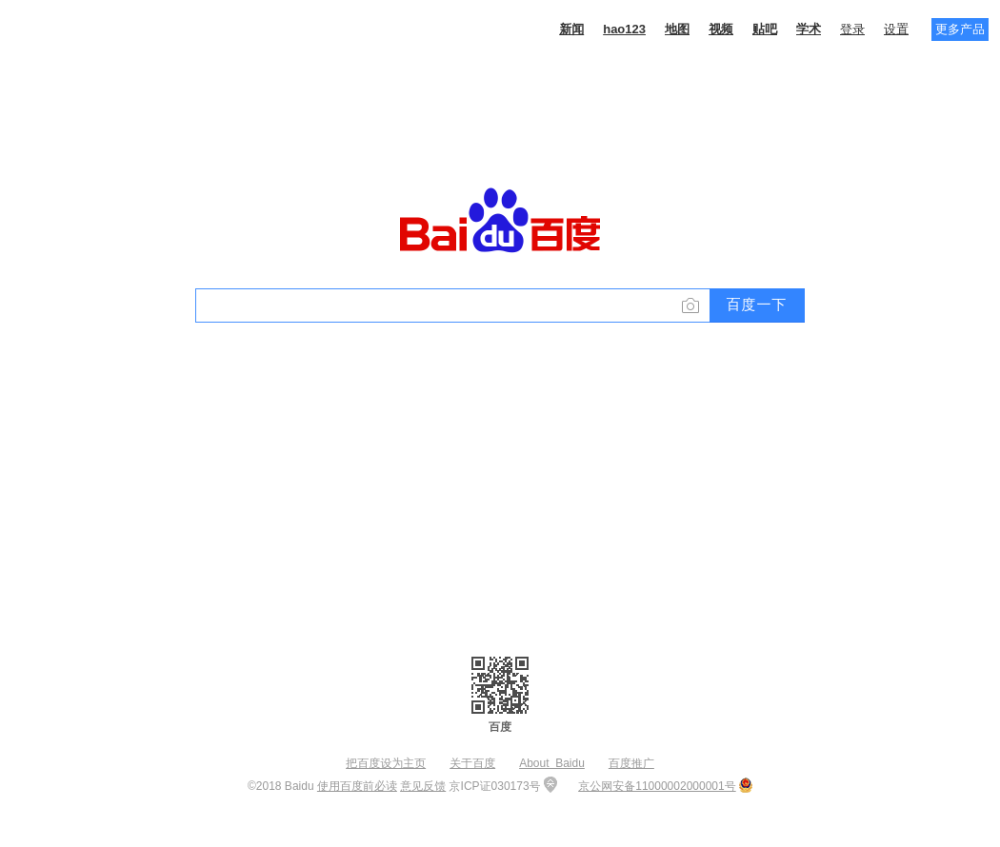

# 利用Docker+Selenium搭建UI自动化测试环境

***需求来源：***

解决客户端环境不一致、浏览器与webdriver版本等导致的自动化脚本运行错误问题。


***参考文档：***

<http://www.51testing.com/html/20/n-3722620.html> 


***自我实践：***

**实践步骤：**

1. 查找docker仓库中selenium、chrome、firefox等相关镜像

2. 安装selenium、chrome、firefox等镜像

3. 启动selenium、chrome、firefox等镜像

4. 编写UI自动化测试脚本

5. 运行UI自动化测试脚本

6. 验证UI自动化测试结果

   

**实现原理：** 


**上机操作：**

1. **查找Selenium相关镜像**

​      docker search selenium


2. **安装Selenium相关镜像**

-  安装selenium/hub镜像

​       docker pull selenium/hub

     

- 安装selenium/node-chrome镜像

   docker pull  selenium/node-chrome


- 安装selenium/node-firefox镜像

  docker pull  selenium/node-firefox

  


3. **启动Selenium相关镜像**

    **输入以下命令，启动Selenium相关镜像：**

    docker run -p 5555:4444 -d --name 'selenium_hub'  selenium/hub

    docker run -P -d --link selenium_hub:hub  selenium/node-firefox

    docker run -P -d --link selenium_hub:hub  selenium/node-chrome

    docker ps 

    

    以上四条命令的作用分别是：

    　　第一条：启动一个Hub的镜像，名称为selenium_hub

    　　第二条：启动一个node的镜像（带chrome浏览器）

    　　第三条：启动一个node的镜像（带firefox浏览器）

    　　检查hub和node的链接情况，用命令查看hub中的日志信息：

    　　docker logs selenium_hub

    

    

    通过本地客户端的浏览器，查看docker中的hub资源信息，并查看docker中的chrome、firefox版本信息，访问地址：

    http://192.168.192.132:5555/grid/console

    其中192.168.192.132为docker所在宿主机对外访问的ip地址, 5555为第一条command中映射的端口号。

    

    

    在docker的宿主机上直接安装Python 3：

    参考资料：

    https://blog.csdn.net/elija940818/article/details/79238813

    上面博客中有个错误：

    ./configure --prefix=/usr/local/bin/python3

    

    https://www.python.org/ftp/python/3.7.0/Python-3.7.0b4.tar.xz

    ```shell
    #安装依赖组建
    sudo yum -y groupinstall "Development tools" 
    
    sudo yum -y install zlib-devel bzip2-devel openssl-devel ncurses-devel sqlite-devel readline-devel tk-devel gdbm-devel db4-devel libpcap-devel xz-devel libffi-devel 
    
    #下载python3安装包
    wget https://www.python.org/ftp/python/3.7.0/Python-3.7.0b4.tar.xz
    
    #解压安装包
    cd ~/Download    #安装包的下载目录
    tar -xvJf  Python-3.7.0a1.tar.xz
    
    #配置python3的安装目录并安装
    cd Python-3.7.0a1
    ./configure --prefix=/usr/local/bin/python3
    sudo make
    sudo make install
    
    #创建软链接
    ln -s /usr/local/bin/python3/bin/python3 /usr/bin/python3
    ln -s /usr/local/bin/python3/bin/pip3 /usr/bin/pip3
    ```

    

    在docker的宿主机上直接安装Selennium：

​       **pip3 install selenium**


​      验证python3及selenium安装成功：


4. **编写UI自动化测试脚本：**

**Chrome浏览器测试脚本：**

```python
#!/usr/bin/python3
#coding=utf-8
from selenium import webdriver
chrome_capabilities ={
    "browserName": "chrome",
    "version": "66.0.3359.170",#注意版本号一定要写对,比对gird中版本信息修正
    "platform": "ANY",
    "javascriptEnabled": True,
    "marionette": True,
}

browser=webdriver.Remote("http://192.168.192.132:5555/wd/hub",desired_capabilities=chrome_capabilities)  #注意端口号5555是我们上文中映射的宿主机端口号,192.168.192.132为宿主机IP地址

browser.get("http://www.baidu.com/")

browser.get_screenshot_as_file("/tmp/Chrome_devops.png")

browser.close()
```


**Firefox浏览器测试脚本：**

```python
#!/usr/bin/python3
#coding=utf-8
from selenium import webdriver
firefox_capabilities ={
    "browserName": "firefox",
    "version": "60.0",#注意版本号一定要写对,比对gird中版本信息修正
    "platform": "ANY",
    "javascriptEnabled": True,
    "marionette": True,
}

browser=webdriver.Remote("http://192.168.192.132:5555/wd/hub",desired_capabilities=firefox_capabilities)  #注意端口号5555是我们上文中映射的宿主机端口号,192.168.192.132为宿主机IP地址

browser.get("http://www.baidu.com/")

browser.get_screenshot_as_file("/tmp/Firefox_devops.png")

browser.close()
```


5. **运行UI自动化测试脚本：**


6. **验证UI自动化测试结果：**

   

   

大功告成。